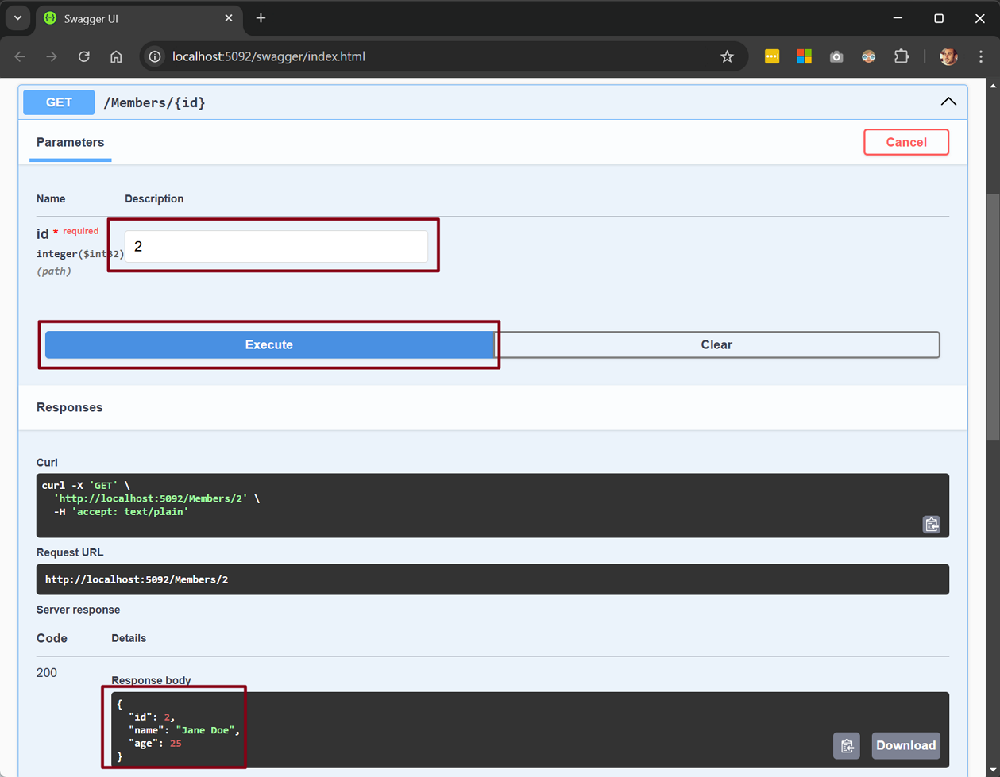

# dotnet-hello-api

This is a simple .NET Core Web API project that demonstrates how to create a simple API using .NET Core. It has been using for several projects / repositories which has been published by [GitHub : Burak Tungut Repositories](https://github.com/btungut)

## Prerequisites

- .NET 9.0 SDK or later
- Visual Studio Code or Visual Studio 2019 or later

## Debugging

- Open the project in Visual Studio Code and press `F5` to start debugging.

### Call */members* endpoint

Open the swagger and click the */members* endpoint and click the `Try it out` button and then click the `Execute` button.

> This API also accepts `filterAgeAbove` query parameters which is optional. If you want to filter the members by age, you can provide the age value as a query parameter.

### Call */members/{id}* endpoint

Open the swagger and click the */members/{id}* endpoint and click the `Try it out` button and then type the `id` value and click the `Execute` button. If the member is not found, it will return a `404 Not Found` response or if the member is found, it will return a `200 OK` response with the member details.

## Owner & Notes

This project is maintained by below:

### Burak Tungut

It only contains the basic structure of the .NET Core Web API project. It has been using for several projects / repositories which has been published by [GitHub : Burak Tungut Repositories](https://github.com/btungut)
